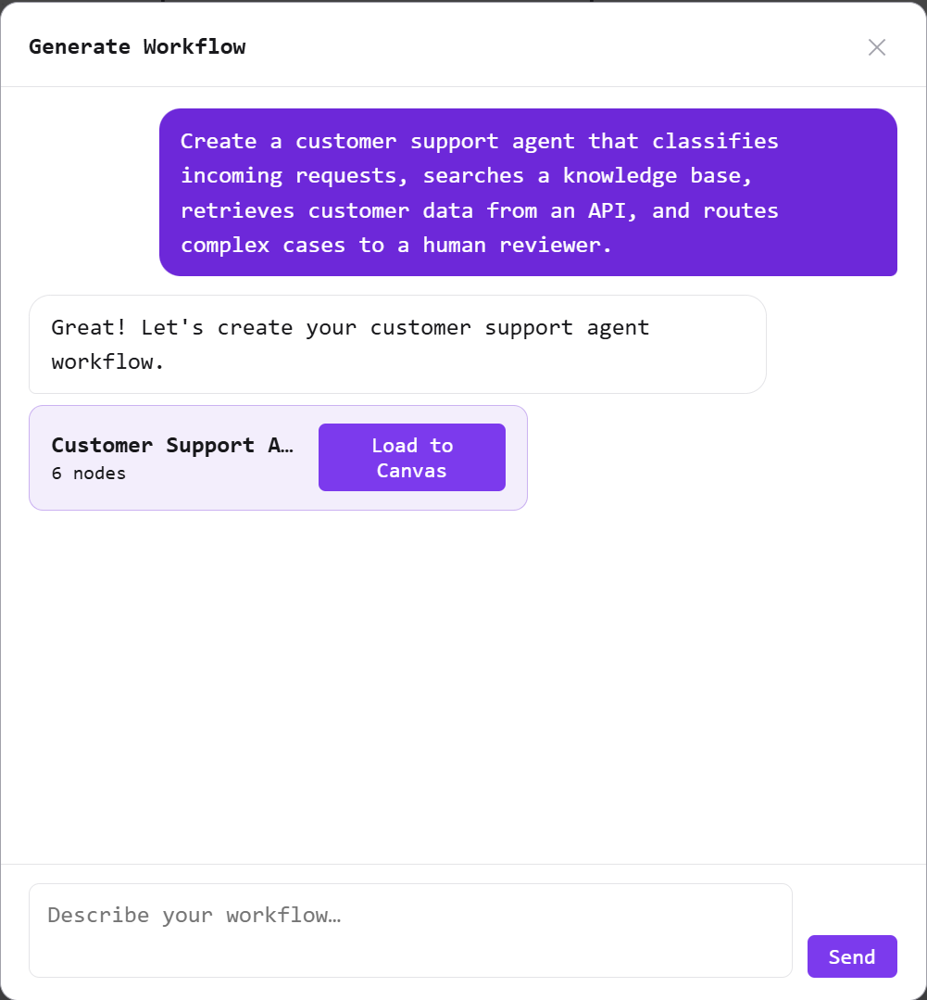
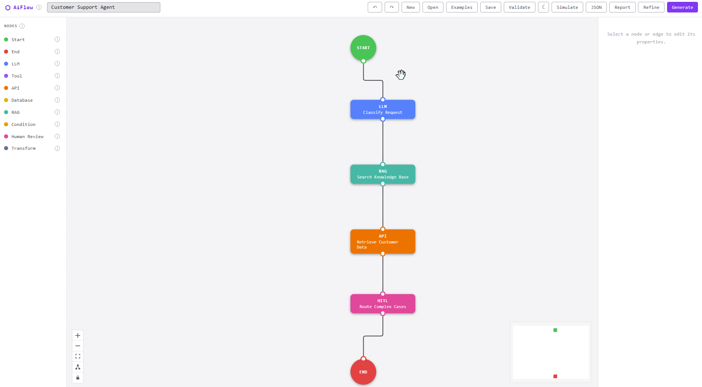
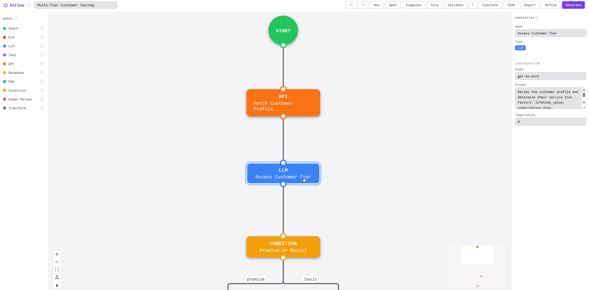
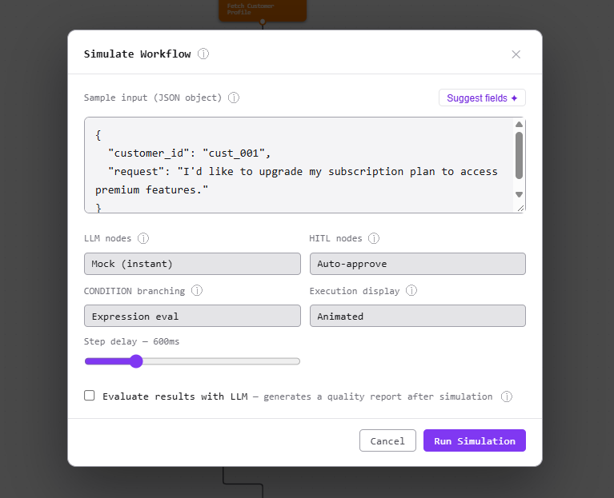
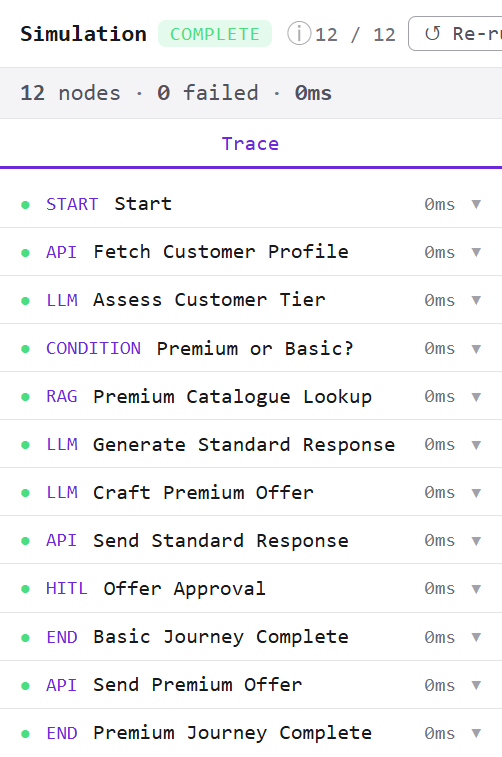
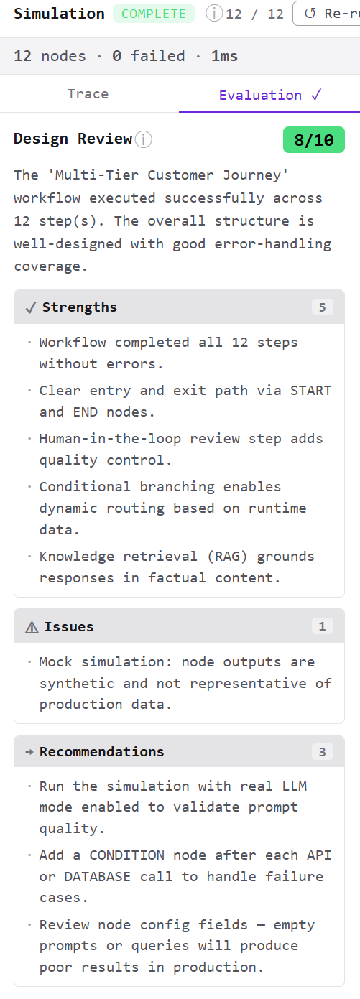

# AiFlow — Designing AI Workflows Visually

*An open-source developer tool for building, simulating, and evaluating agentic AI workflows.*

---

I've been building a side project called **AiFlow** — a visual workflow designer for AI/agentic systems. The idea is simple: describe what you want your AI agent to do in plain English, and the tool generates a working workflow you can then inspect, edit, and simulate.

Here's a quick look at what it does.

---

## Describe → Generate

You open a chat window, type something like:

> *"Create a customer support agent that classifies incoming requests, searches a knowledge base, retrieves customer data from an API, and routes complex cases to a human reviewer."*

The AI generates a complete workflow — nodes, edges, configuration — and renders it on the canvas in seconds.

<!-- SCREENSHOT 1 ─────────────────────────────────────────────────────────────
  What to capture: The Generate/chat modal open on the left, and the resulting
  workflow rendered on the canvas behind it (or just after closing the modal).
  The workflow should have ~6–8 nodes: START → LLM (Classify) → RAG (Knowledge
  Search) → API (Customer Data) → CONDITION (Simple/Complex) → END + HITL
  (Human Review) → END.
  Ideal viewport: full app window, dark theme, modal taking the left ~40%.
  File name suggestion: 01-generate.png
─────────────────────────────────────────────────────────────────────────────-->

---

## Design on the Canvas

The generated workflow is fully editable. You can drag nodes around, connect them by drawing edges between handles, delete or duplicate nodes via right-click, and configure each node's properties in the panel on the right (prompt, model, API method, SQL query, condition expression, etc.).

A few quality-of-life features that made a difference:
- **Auto-layout** arranges the graph in a clean top-to-bottom DAG with one click
- **Snap-to-grid** keeps things tidy while dragging
- **Multi-select + alignment toolbar** for lining up groups of nodes
- **Undo / Redo** — nothing is permanent

<!-- SCREENSHOT 2 ─────────────────────────────────────────────────────────────
  What to capture: The main canvas with a reasonably complex workflow (6–10
  nodes). Select one node so the Properties Panel is showing on the right with
  some config fields filled in (e.g. an LLM node with a "prompt" field).
  Show the mini-map in the bottom-right corner. Dark theme.
  File name suggestion: 02-canvas-properties.png
─────────────────────────────────────────────────────────────────────────────-->

---

## Simulate

Once the workflow looks right, you hit **Simulate**. You paste in a sample JSON input, pick how the simulation should behave (mock LLM calls or real API calls, auto-approve or pause at human-review nodes, animated step-by-step or instant), and run it.

The backend traverses the graph and each node lights up on the canvas as it executes. A trace panel on the right shows every step — node type, status, duration, and the exact input/output JSON for that step.

<!-- SCREENSHOT 3 ─────────────────────────────────────────────────────────────
  What to capture: The simulation actively running (or just completed). The
  canvas should show nodes in different states: some green (success), one blue
  with pulsing ring (running/current), and perhaps one dimmed (pending).
  The trace panel on the right should show 3–5 expanded/collapsed step rows
  with status dots. Dark theme.
  File name suggestion: 03-simulation.png
─────────────────────────────────────────────────────────────────────────────-->

---

## Evaluate

After the run completes, an optional **Design Review** scores the workflow design (1–10) and returns a structured report: strengths, issues found, and concrete recommendations for improvement. This is generated by the same LLM powering the generator — it reads the full execution trace and assesses the architecture.

<!-- SCREENSHOT 4 ─────────────────────────────────────────────────────────────
  What to capture: The "Design Review" tab active in the right panel, showing
  a score badge (e.g. 7/10 in green), a 1–2 sentence summary, and the
  Strengths / Issues / Recommendations sections expanded. The canvas is
  visible in the background with completed (green) nodes. Dark theme.
  File name suggestion: 04-design-review.png
─────────────────────────────────────────────────────────────────────────────-->

---

## What's under the hood

- **Frontend**: React + TypeScript + React Flow (xyflow)
- **Backend**: Python + FastAPI — the graph traversal, LLM calls, and evaluation all run server-side
- **LLM**: provider-agnostic — works with OpenAI, or any local model via LM Studio / Ollama
- **Persistence**: workflows are stored as plain JSON, with localStorage keeping your work across refreshes

The internal workflow model is clean and provider-neutral — the plan is to export it as executable LangGraph / LangChain code in a future release.

---

This is still early-stage, but the core loop — **describe → generate → design → simulate → evaluate** — is working end-to-end. I'm building it to scratch my own itch: I kept sketching agentic system designs on whiteboards and wanted a faster path from idea to something runnable.

If this sounds useful, follow along — more to come.

---

*#AI #AgenticAI #LangGraph #OpenSource #DeveloperTools #Python #React*
